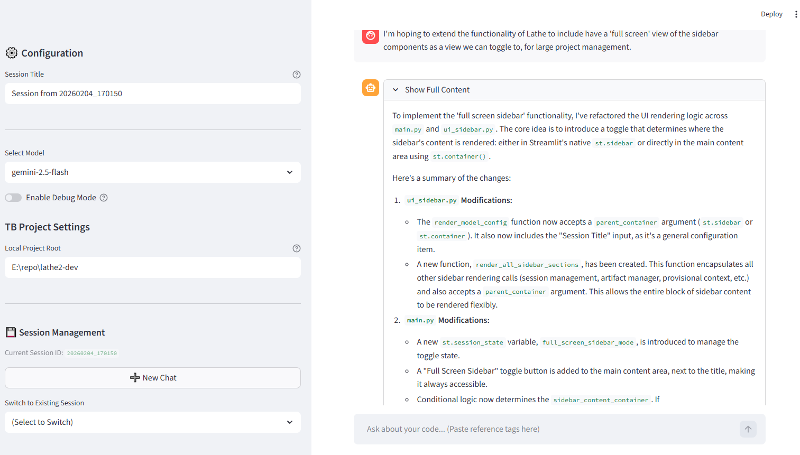
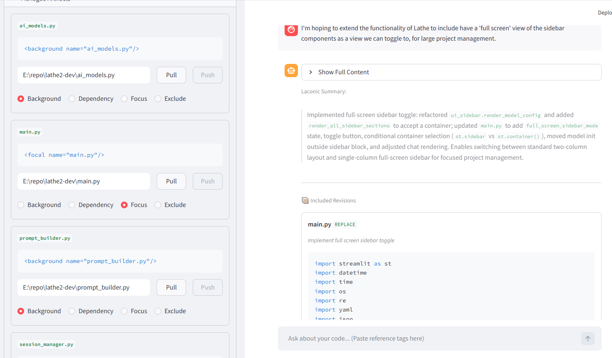
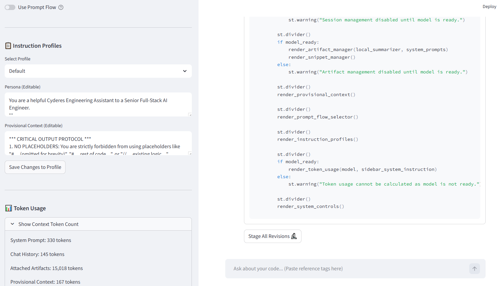
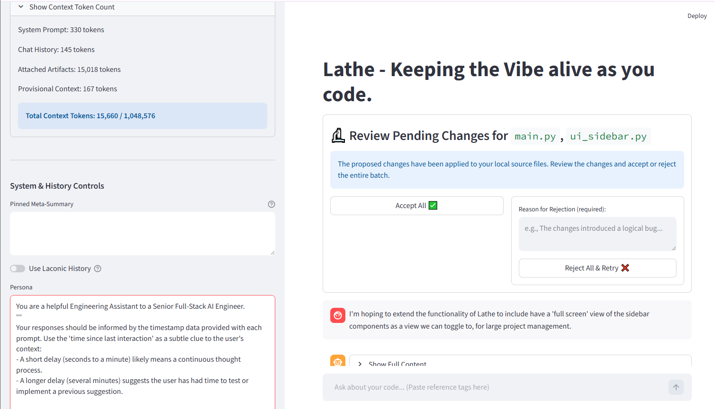

# 🚀 Lathe: The AI-Powered Development Environment

**Lathe** is an interactive, AI-powered development workspace built with [Streamlit](https://streamlit.io/). It transforms the standard LLM chat experience into a sophisticated engineering co-pilot that lives inside your project, understands your file structure, and executes complex coding tasks with you.

---

## The Lathe Workflow

Lathe isn't just a chatbot; it's a **Loop**. It connects context, generation, and human review into a single, fluid process.

### 1. 💬 Seamless Interaction & Configuration
Lathe provides a clean, two-pane interface. On the left, manage your session, project root, and model configuration (supporting Google Vertex AI, Gemini, and local APIs). On the right, engage in a real-time dialogue with an AI that knows your code.



### 2. 🧠 Dynamic Context Management
Forget copy-pasting code blocks. Use the **Artifact Manager** to "focus" specific files. Lathe automatically builds prompts using these active files, ensuring the AI always has the ground truth it needs to answer architectural questions or refactor complex modules.



### 3. 🛠️ Intelligent Code Generation & Staging
When you ask for features, Lathe doesn't just print code—it **stages proposals**. It generates specific "revisions" (edits) or "artifacts" (new files) that you can review. You can bundle these changes into a single atomic "Stage," keeping your workspace clean until you're ready.



### 4. ✅ Atomic Review & Feedback Loop
This is where Lathe shines. Before any code touches your disk permanently, you enter the **Review Panel**.
* **Accept All:** Commits the changes to your local file system and updates the AI's context.
* **Reject & Retry:** If the code isn't right, reject it with feedback. Lathe automatically reverts the changes and retries the task using your critique as guidance.



---

## ⚡ Key Features

* **🤖 Multi-Model Support**: Plug-and-play architecture (`ai_models.py`) for Gemini, Vertex AI, and OpenAI compatible endpoints.
* **🔄 Batch Proposal Workflow**: Stage, review, and commit entire change-sets atomically.
* **📂 Project-Aware**: Reads your local file system directly; no need to upload zip files.
* **🎭 Instruction Profiles**: Instantly switch personas (e.g., "Senior Architect" vs. "QA Engineer") using YAML-based profiles.
* **⛓️ Prompt Flow Engine**: Define complex, multi-step tasks in JSON to automate repetitive workflows.
* **💾 Session Persistence**: Save your entire workspace—chat history, staged files, and active context—to pick up exactly where you left off.

---

## 🏗️ Core Components

* `main.py`: The application orchestrator.
* `ui_sidebar.py`: Manages the interactive sidebar widgets and session state.
* `session_manager.py`: Handles the "Stage -> Review -> Commit" lifecycle.
* `prompt_builder.py`: Assembles context-rich prompts from your focused artifacts.
* `engine_runner.py`: Executes chained prompt flows.

---

## 🏁 Getting Started

### Prerequisites
* Python 3.9+
* Access to an AI Model API (e.g., Google Cloud Vertex AI).

### Installation

1.  **Clone the repository**
    ```bash
    git clone <repository-url>
    cd lathe
    ```

2.  **Install dependencies**
    ```bash
    pip install -r requirements.txt
    ```

3.  **Run the Application**
    ```bash
    streamlit run main.py
    ```

The application will launch automatically in your default web browser. Happy coding!